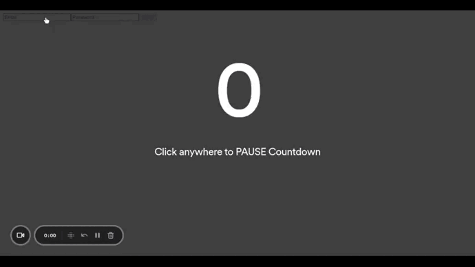
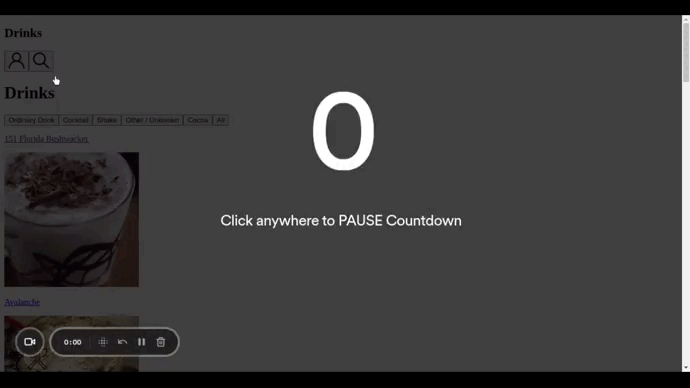

# Projeto 16 - Recipes App

Oi. Este foi um dos projetos que eu fiz durante meu curso na Trybe. Confira os detalhes dele abaixo.

## Nome do Projeto
Recipes App (App de Receitas)

## Linguagens e Ferramentas Utilizadas

 - JavaScript
 - HTML
 - Kanban
 - [Biblioteca React](https://pt-br.reactjs.org/)
 - [React Router](https://reactrouter.com/en/main)
 - Context API e React Hooks

## Objetivos do Projeto
Neste projeto foi desenvolvida uma aplicação de app de receitas. Ele foi realizado em grupo, e junto comigo realizaram o projeto: [Matheus França](https://github.com/matfbs), [Petrson Paganelli](https://github.com/Peterson-Paganelli) e [Stenio Santos](https://github.com/StenioSantos97). A organização do grupo foi feita por meio do uso da metodologia ágil Kanban, diagramada em um quadro na ferramenta [Trello](https://trello.com/).

 
Na aplicação, foi consumida duas API, uma de [alimentos](https://www.themealdb.com/), e uma de [bebidas](https://www.thecocktaildb.com/api.php). A partir dos dados das APIs, o usuário pode fazer uma gama de atividades no app, como: visualizar listas de receitas, filtrar as listas, procurar receitas, clicar em uma receita e ser redirecionado para uma página detalhada, visualizar receitas que harmonizam com a escolhida, iniciar o preparo da receita, entra outros.  

 

O projeto utilizou o context API e alguns React Hooks para o desenvolvimento da aplicação. Este foi o último projeto do módulo de Front-End da Trybe, e por esse motivo, teve um tamanho maior.

 
Abaixo estão alguns GIFs que mostram a aplicação funcionando (vale lembrar que o objetivo principal do projeto era desenvolver a aplicação com foco na arquitetura do site utilizando React Hooks e Context API, e, por isso, não foi desenvolvido o CSS, portanto a aplicação está sem estilização).
 

Página inicial, de login, e sendo redirecionado para a página de receitas. 

 

 

Mostrando a página de receitas (comidas), mostrando a filtragem, clicando em uma receita, que redireciona para a página de detalhes, e mostrando a página de detalhes.

 

 

Na página de detalhes, realizando algumas ações, como: copiar link da receita, favoritar a receita, e iniciá-la, redirecionando para a página de receita em progresso, onde é possível fazer uma checklist dos ingredientes.

 

 

Na página de receitas inicial, clicando botão que altera para mostrar as receitas de bebidas. Depois, filtra-se as bebidas, seleciona uma delas, favorita e inicia. 

 

 

Na página de receitas inicial, clicando botão de perfil, que redireciona para a página de perfil. Depois, clica botão para visualizar as receitas favoritadas. Volta para a página de perfil e clica em logout, onde redireciona para a página de login.

 

 

## Instruções para visualização
Comando para clonar o projeto:
 - `git clone git@github.com:BrunoSayago/projeto-16-RecipesApp.git`
 
Se necessário, instalar as dependências:
 - `npm install`
  
O projeto pode ser visualizado no navegador utilizando o comando:
- `npm start`
